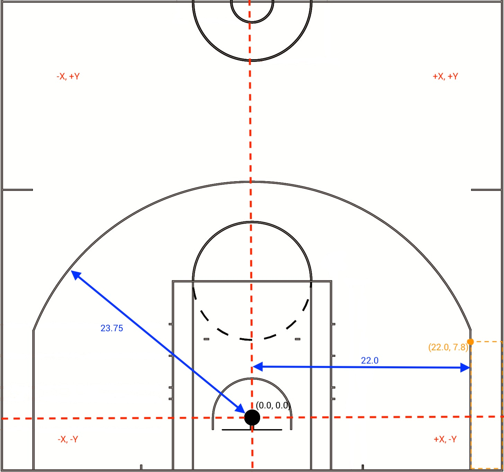

# Shot_Distribution_Analysis
This repository contains my solution to the following assesment. I have also included a Jupyter notebook that plots thegiven data into a scatter plot. The problem is stated as follows:
For the provided shot coordinate and outcome dataset, determine the effective field goal
percentage and percentage of team shots attempted (shot distribution)
within the following shot zones: Two Point (2PT), Non Corner 3 (NC3) and Corner 3 (C3).
The following is an outline of the provided datasets:
1) court_diagram.jpg
• An annotated diagram of the official NBA Court. All markers are measured in feet relative
to the center of the hoop
• For all “Non Corner” 3’s (where Y > 7.8), the 3PT line is 23.75 ft from the center of the hoop
• For all “Corner” 3’s (where Y <= 7.8), the 3PT line is 22 feet from the court’s Y-axis at all
points (note the definition of “Corner” 3 is not determined by the “break” in the arc)
2) shots_data.csv
• team: name of team (Team A, Team B)
• x: X-coordinate of the shot, measured in feet
• y: Y-coordinate of the shot, measured in feet
• fgmade: boolean value indicating the outcome of the shot (0=Miss, 1=Make)
Determine the shot zones (2PT, NC3 or C3) and calculate for each team the:
• Shot Distribution: the percentage of team shots attempted within a zone
• eFG%: the effective field goal percentage of team shots within a zone (note the formula fo eFG = (FGM +(0.5+3PM))/FGA

Deliverables:
shot_distribution.py: contains the answers for the problem stated above. My output is below:

basketball_shot_chart.ipynb: contains a scatter plot made using matplotlib that plots the 'x' and 'y' coordinates of missed and made shots respectively. 
The dimensions were made to the standard of court_diagram and online rescource both of which can be seen below.
 

 

 

My shot charts for Team A and Team B respectively can be seen below: 

